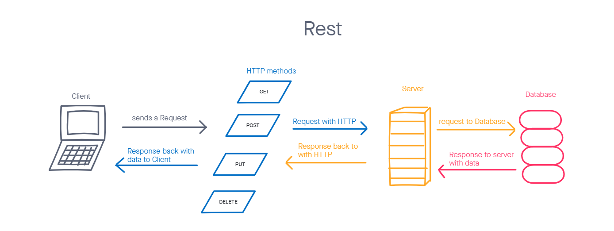

# resty

## Author: Louis Lassegue

## Setup

In the project directory, you can run:

`npm start`
- Runs the app in the development mode.
- Open http://localhost:3000 to view it in the browser.

- The page will reload if you make edits.
- You will also see any lint errors in the console.

`npm test`
- Launches the test runner in the interactive watch mode.
- See the section about running tests for more information.

## Development Process

### Phase 1: Application Setup
- Basic React Application

- Scaffolding

- Basic State

- Rendering

### Phase 2: Testing and Deployment
- Receiving user input in preparation of connecting to live APIs, using the useState() hook in our functional components

- Testing of React components and applications

- Deploy to GitHub Pages and Netlify

### Phase 3: State and Props
- Create multiple components to handle each aspect of the Application

- Sharing state and behaviors between components

- Basic layout and styling

### Phase 4: Fit and Finish
- Incorporate the spinner, using conditional rendering

- App is Fully Tested

- App is Fully Documented

- RESTy is Deployed and publicly available

## Tests

- test the App component
  - upon submitting the form will result in data being rendered in the output area

- Testing API effect
  - app should fetch
## UML

- Rest

- 

## Links

- [Codesandbox.io Link](https://qbnvp.csb.app/)
- [Netlify Link](https://amazing-bassi-ad1b1b.netlify.app/)
